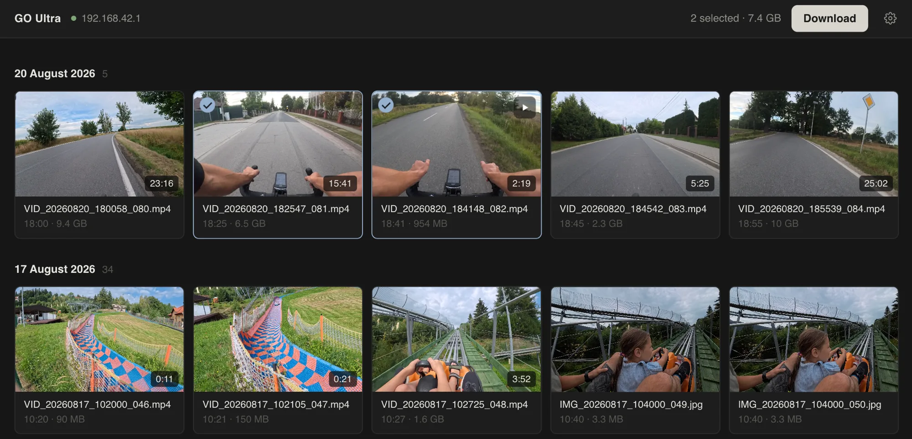

# Insta360 GO Ultra transfer

Browse, preview, and copy media from the Insta360 GO Ultra over WiFi — no USB, no official app.

A small local web app: a dependency-free Python backend speaks the camera's WiFi
protocol, and a React UI gives you a date-grouped gallery with live previews,
multi-select, and Finder-style download progress.



## Install

```sh
brew install veelenga/tap/igut
```

## Usage

Connect your computer to the camera's WiFi hotspot (`GO Ultra XXXXXX.OSC`), then:

```sh
igut server                     # web UI at http://127.0.0.1:8765
igut ls                         # list files on the camera
igut ls --day 2026-08-20        # one day only
igut download "VID_20260820*"   # copy by glob
igut download --day 2026-08-20  # copy a whole day
igut download --all -o ~/rides  # copy everything
```

Downloads land in `~/Downloads/GoUltra` unless `-o` says otherwise. LRV proxy
files are skipped by default; add `--lrv` to include them.

## From source

Requires Python 3.10+ and Node 20+ (only to build the UI once):

```sh
git clone https://github.com/veelenga/insta360-go-ultra-transfer.git
cd insta360-go-ultra-transfer/web
npm install && npm run build
cd .. && python3 server.py
```

For UI development, `npm run dev` starts a Vite dev server that proxies
`/api` to `server.py` on port 8765.

## Releasing

Pushing a `v*` tag builds the UI, packages a tarball, creates the GitHub
release, and updates the formula in
[veelenga/homebrew-tap](https://github.com/veelenga/homebrew-tap)
(requires the `TAP_GITHUB_TOKEN` repo secret).

## Diagnostics

Settings (gear icon) → Diagnostics log shows every protocol frame and HTTP
request, with a copy button. The same log is written to `go-ultra.log`.

## How it works

The camera exposes two services on its WiFi hotspot (default IP `192.168.42.1`):

- **TCP 6666** — control channel. Framing is `[u32 LE length][payload]`.
  A sync handshake (`06 00 00` + `syNceNdinS`, echoed by the camera) opens the
  session; a bare `05 00 00` keepalive every 2 seconds keeps it alive.
  Commands are `04 00 00 | cmd u16 LE | 02 | seq 3-byte LE | 80 00 00 | protobuf`;
  responses carry code 200 at bytes 3–4 and the protobuf body from byte 12.
  File listing is command 13: request `{1: media_type, 2: start, 3: limit}`,
  response `{1: repeated uri, 2: total_count}`.
- **HTTP 80** — media. Plain `GET http://<camera-ip><uri>` with Range support.
  It only answers while the TCP session is alive, so the backend holds the
  session open during transfers.

Previews use the camera's `.lrv` proxy files (small H.264 twins of each `.mp4`),
streamed through the backend with Range requests. LRV files are hidden in the
gallery by default — toggle them in settings.

Environment overrides: `GOULTRA_IP`, `GOULTRA_TCP_PORT`, `GOULTRA_HTTP_PORT`,
`GOULTRA_UI_PORT`.

## Credits

Protocol knowledge builds on
[insta360-go-ultra-sdk](https://github.com/Daiki-Iijima/insta360-go-ultra-sdk)
and the session/HTTP-gating model documented by
[insta360-luna-ultra-desktop](https://github.com/Ripwords/insta360-luna-ultra-desktop).

## Disclaimer

Unofficial, not affiliated with Insta360 / Arashi Vision. Use at your own risk.
